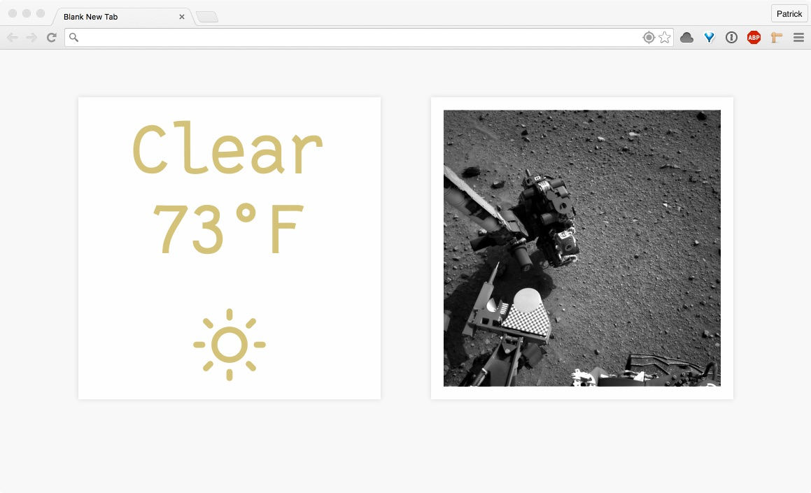

# launchpad
My own personal New Tab page.

## Installation
1. `$ git clone https://github.com/tlindsay/launchpad.git`
2. Chrome -> Extensions -> Load Unpacked Extension -> [Wherever you saved it]
3. Profit

## To Do
- [ ] Make AJAX non-blocking
- [ ] Make font load non-blocking
- [ ] Get the damn `.sass-cache` out of the repo
- [ ] Clean up all the things
- [ ] Handle NASA API failures
- [ ] Figure out what other cards I want to include
